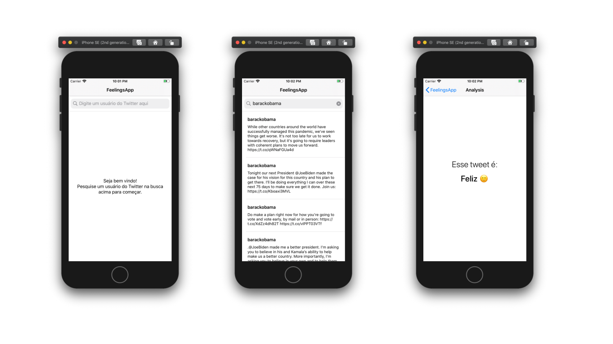

# Tweet Analysis App
> Tweets Analysis App, using URLSession, Twitter API and Google Natural Language API

[![Swift Version][swift-image]][swift-url] [![Swift Version][swift-image]][swift-url] [![License][license-image]][license-url]  [](http://makeapullrequest.com)

An iOS App that lists a user's tweets and classifies them by emotion.



## Requirements
- Xcode 11

## How to run the project
Clone or Download the project and follow these steps:.

#### Generate project with Tuist
In order not to commit .xcodeproj files (bye merge conflicts!) and much more cleaner project settings, I decided to use [Tuist](https://github.com/tuist/tuist).

If you don't have Tuist installed in your Mac, don't worry. It's so easy, just run this command to install:

```
bash <(curl -Ls https://install.tuist.io)
```

After that, to generate the .xcworkspace and .xcodeproj, run the following commands:

```bash
tuist up # Setting up the environment
tuist focus # generate the files and open in Xcode
```

#### Api Keys
First of all, you'll have to generate API Key for **[Google Natural Language API](https://cloud.google.com/natural-language/)** and **[Twitter API](https://developer.twitter.com)**.
After generating these keys, create a swift file ***APIKeys.swift*** and complete with the keys, like the code below:

```swift
import  Foundation

enum  ApiKeys: String {
	case googleKey = "[YOUR GOOGLE API KEY HERE]"
	case twitterToken = "bearer [YOUR_TWITTER_TOKEN_HERE]"
}
```
Add this file in **Projects/MainApp/FeelingAnalysisApp/Sources/AppSupport** folder, and then run ```tuist focus``` to generate the project. Tap run button and enjoy it!

## Frequently Asked Questions

#### Why did I use MVVM?
The reason is that MVVM is one of the most used architectures in companies today, it makes unit testing much easier, because the purpose of MVVM is that the code is broken up into classes with a small number of well defined responsibilities. Following up SOLID principals and having a clean, maintainable and testable code.

#### How did I mock the dependencies?
I use a tool called Swift Mock Generator for Xcode. This tool is a plugin and command line tool to generate spy, dummy, partial spy classes automatically, without add any third libraries in your project. I highly recommend!

#### Why not using Storyboards/Xibs?
There are several reasons why I prefer to create my views programmatically, but the main reason is that it improves the build time of the app. This is topic that many huge companies are concerned.
Another reason is that it is on my roadmap to implement Buck and using Xib / Storyboard can cause some extra issues.


## Roadmap
- implements Buck Build System
- improve Network Layer
- implement UI Tests with [EarlGrey](https://github.com/google/EarlGrey)

## Thank You!

Décio Montanhani – [@deciomontanhani](https://twitter.com/deciomontanhani) – https://deciomontanhani.com.br

[swift-image]:https://img.shields.io/badge/swift-5.0-orange.svg
[swift-url]: https://swift.org/
[license-image]: https://img.shields.io/badge/License-MIT-blue.svg
[license-url]: LICENSE
[travis-image]: https://img.shields.io/travis/dbader/node-datadog-metrics/master.svg?style=flat-square
[travis-url]: https://travis-ci.org/dbader/node-datadog-metrics
[codebeat-image]: https://codebeat.co/badges/c19b47ea-2f9d-45df-8458-b2d952fe9dad
[codebeat-url]: https://codebeat.co/projects/github-com-vsouza-awesomeios-com
